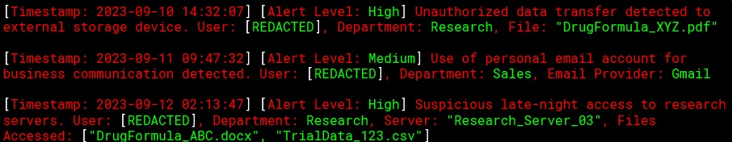

## Performance Questions

### Log Analysis

<u> Mitigation Actions</u> 

1. `Data Loss Prevention` to address the unauthorized data transfer issue by monitoring and controlling data transfers across the company network. 
2. `Email Content Filtering` by inspecting email content and blocking transfers.
3. `Restricting After-Hours Server Access` by limiting time frames the servers are accessible. 
  

<u> Data Transfers</u> 

- `HTTPS`

<u> Web Applications</u> 

- Cipher: `AES-256-GCM-SHA384`
- TLS Version: `1.3`

<u> Compliance Considerations</u> 

- `HIPPA`

---

### Data Infrastructure

<u>Data Center Infrastructure</u> 

 
|    Benefit                            | Drawback           | 
|:------------------------------------:|:------------------:|
| Less Complex Infrastructure          | Signle Vender      |
| Server Redundancy                    |  Onsite Backup     | 

<u>Cloud Infrastructure</u> 

 
|    Benefit                   | Drawback                    | 
|:---------------------------:|:---------------------------:|
| MultiVender  Infrastructure | More Complex Infrastructure |
| More Resilient Operations   | Price Variations            |

<u> Recomendations</u> 

- Best Solution: `Cloud Infrastructure`
- `Multiple Venders`
- `Power Redundancy`
- `Resilient Backups`

---

### Situation

- Security Engineer: 
  - Mobile Device management
    - MDM solutions can enforce security policies and monitor user behaviour and generate alerts.
- CEO: 
  - Location services
- CTO: 
  - Geofencing
    - Can alter capabilities of a device and turn functionality on or off to limit mobile device function based on location
- Infrastructure manager: 
  - Hotspots
- Devops: 
  - MicroSD HSM
    - Hardware Security Module cards can work with existing MDM software for authentication and Public Key Infrastructure functions.
- Accountant: 
  - Remote wipe

---

### IP Connections / FQDN and certificates

> Junior Pen Test: 
> - Browsing website using IP address. 
> - Browser displays certificate error

- Issue: Cert configured with FQDN
    - Connect with FQDN, Not IP address
- Solution: Connect with HTTPS
  - https://www.comptia.org 

> Program Manager:
> - Cert cibfugred right
> - Client related?

- Issue: Server rejects a certificate
  - Missing Chain of Trust
    - Missing Root/Intermediate CA certs
    - Dont use FQDN, Use the IP
- Solution: 
  - Install root CA-G2 Cert
  - Install secure CA-G2 Cert

---

### Remote connection 

> Choose remote connect method for robust security and scaleability
> Authentication strat with asymmetric tech
> Layers of security for user authentication

1. Remote Access Method:
   1. VPN
2. User Authentication:
   1. MFA
3. Device Authentication:
   1. Pub Key 

> Key security Considerations for remote access

- [ ] Firewall rules Based on user Roles
- [ ] Encrypted Log storage
- [ ] IDS 
- [ ] Disable Clipboard Sharing
- [ ] Secure Data Transmission
- [ ] Enable Rate Limiting on Login Attempts

---

### Security Controls

1. > Owner: malicioius actor in machine, add systems that identify activity on our network

   - Security Control Remediation:
     - Technical
       - Technical controls encompass hardware and software
   - Functional Type: 
     - Detective: 
       - Detective Controls identify and record attempts
   - Control:
     - Setup Firewall

2. > IT Manager: Employees visiting unsecure websites

   - Security Control Remediation:
     - Operational:
       - Operational controls involve human element - policies procedures and training
   - Functional Type:
     - Directive
       - These controls enforce rule behaviors like policies, best practice or SOP's
   - Control:
     - Create a policy 

3. > Network Admin: Server room not behind locked door.

   - Security Control Remediation: 
     - Physical
   - Functional Type:
     - Preventive:
       - Preventive controls act to eliminate or reduce likelihood of an attack
   - Control:
     - Keycard 

---

### Line of Credit Loan

1. Renewing Defenses
   1. Reinstante VPN acccess
   2. restore SSL/TLS encryption
   3. Activate security Event monitoring
2. User access security
   1. Apply ABAC
   2. Restrict admin access by location
   3. adopt MFA
3. Reviewing of existing configurations
   1. Keep record of restoration steps
   2. Validate Current setup against industry standards
   3. Examine system audit trails
4. Preemptive Actions
   1. Routine security review cycle
   2. Apply patch management 
   3. Mandate training sessions
   4. Facilitate data redundancy 
   5. Designate cyber incident team

---

### Medical Access and Regulations

1. Access:

- Front Desk Interns: PCI DSS - Billing
  - [ ] Patient Information
  - [ ] Billing Codes
- Medical Co-Ops: assist in the plans, address with symptoms
  - [ ] Patient Medical Symptoms
  - [ ] Recomended Treatment Plans
- Clinic Staff: all
  - [ ] Medical Records
  - [ ] Patient Information
  - [ ] Patentia Medical SYmtoms
  - [ ] Recomended Treatment Plans
  - [ ] Patient Treatment Data
  - [ ] Billing Codes
- Governance Committee: doesnt need patient info
  - [ ] Medical Rcords
  - [ ] Patient Medical SYmtoms
  - [ ] Recomended Treatment Plans
  - [ ] Patient Treatment Data
  - [ ] Billing Codes

2. Regulations
  
|  HR System | Patient Database System |
|:----------:|:-----------------------:|
| SoX        | HIPAA                   |
| ISO 27001  | PCI DSS                 |
| CCPA       | ISO 27017               |

HR:

- SOX: Sarbanes–Oxley Act -- Financial Records
- ISO 27001: HR data security of people
- CCPA Personal Data 

Database:

- HIPPA governs handling, storage and sharing of PHI
- ISO 27017 Provides guidelines for securing cloud based systems and data 

